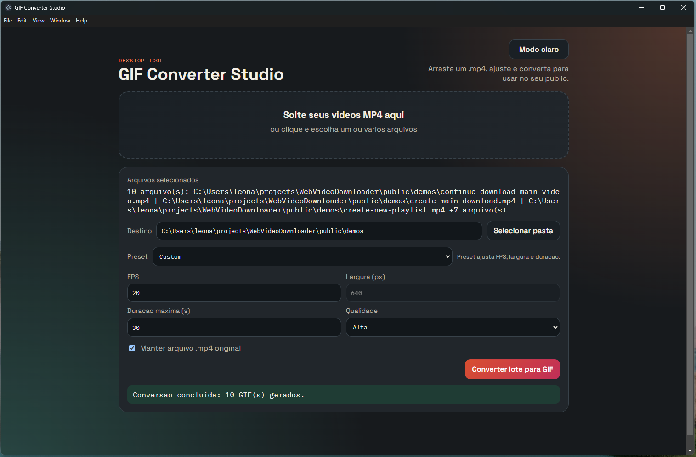

# GIF Converter Studio

Desktop application to convert `.mp4` videos into optimized `.gif` files with a simple drag-and-drop workflow.

<p align="center">
	
	
	
	
	
	
</p>

## Overview

GIF Converter Studio is an Electron-based desktop tool focused on fast, practical GIF generation for documentation, portfolios, and demos. It supports single and batch conversion, drag-and-drop selection, quality presets, theme switching, and output directory control.

The conversion pipeline uses ffmpeg palette generation (`palettegen` + `paletteuse`), optional automatic black-border removal, and adjustable parameters such as FPS, width, max duration, and quality level.

## Visual Preview

<p align="center">
	
</p>

## Key Features

- Convert one or multiple `.mp4` files in sequence
- Drag-and-drop uploader with click-to-select fallback
- Quality selector: High, Medium, and Low
- Automatic black border detection and crop before GIF generation
- Adjustable FPS, output width, and max duration (default: 30s)
- Light/Dark mode toggle with persisted preference
- Option to keep or remove original `.mp4` after conversion

## Tech Stack

- Electron
- Node.js
- fluent-ffmpeg
- ffmpeg-static
- electron-builder (NSIS target for Windows installer)
- HTML, CSS, and vanilla JavaScript for the renderer UI

## Getting Started

### Requirements

- Node.js 18 or newer

> This project uses `ffmpeg-static`, so a global ffmpeg installation is not required.

### Run Locally

```bash
npm install
npm start
```

## Build Windows Installer

```bash
npm run build:win
```

The output is generated inside `dist/` as a one-click NSIS installer.

## Usage

1. Drop one or more `.mp4` files into the upload area (or click to browse).
2. Choose the output folder.
3. Select a preset or manually configure FPS, width, duration, and quality.
4. Click **Convert Batch to GIF**.
5. Check the status area for completion and output path details.

## Notes

- Supported input format: `.mp4`
- Batch conversion is processed sequentially
- High quality can preserve original width depending on selected settings
- Output quality and file size are influenced by FPS, duration, dimensions, and palette settings
